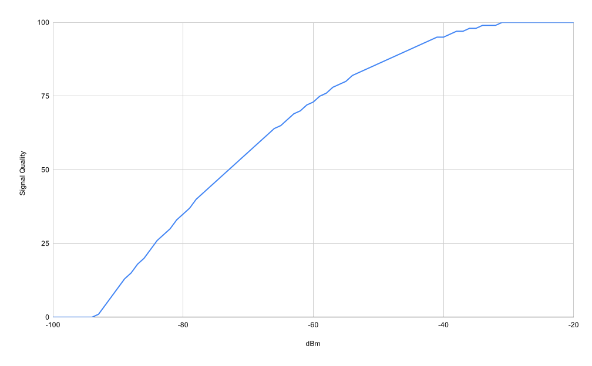

# RSSI LUT

A simple tool to generate a lookup map for RSSI values to percentage in ts.
The script generates a `rssi-lut.ts` and `rssi-lut.js` files which can be used in a js/ts project and an `rssi-lut.csv` file which can be used in a spreadsheet.

You can adjust the `worst` and `best` values to change the range of the lookup map, and you can adjust the `delimiter` value to change the delimiter of the CSV file.

Based on [linux's ipw2200](https://github.com/torvalds/linux/blob/9ff9b0d392ea08090cd1780fb196f36dbb586529/drivers/net/wireless/intel/ipw2x00/ipw2200.c#L4321) implementation.

The graph below shows the dBm to RSSI plot for best and worst values of -30 and -85 respectively.



## Usage

```bash
node index.js
```